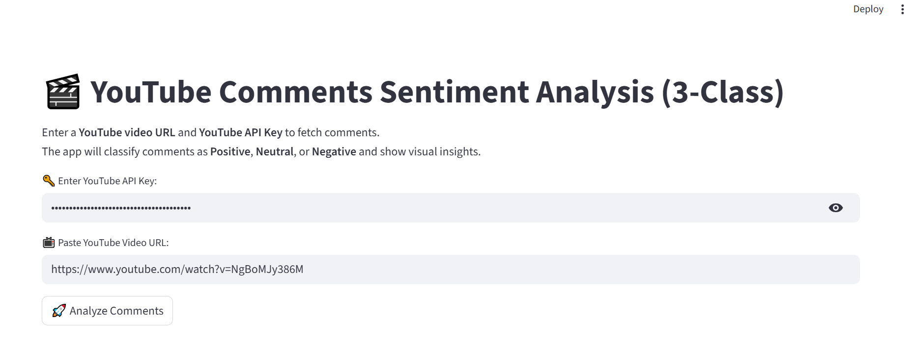
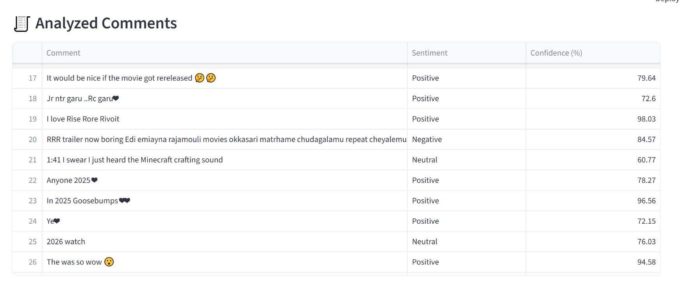
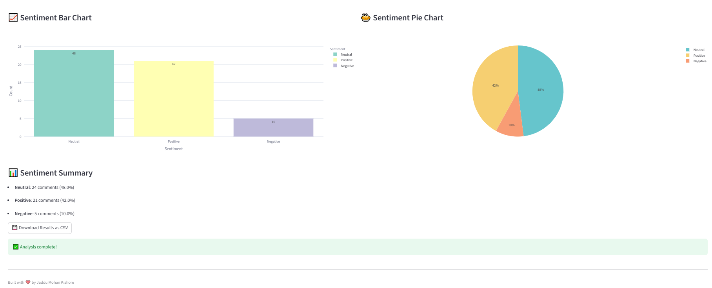

# 🎬 YouTube Comments Sentiment Analysis Web App

[](https://www.python.org/)
[](https://streamlit.io/)
[](LICENSE)

---

## 💡 Project Overview

This project is a **YouTube Comments Sentiment Analysis Web App** built using **Streamlit** and **Hugging Face Transformers**.  
It fetches comments from any public YouTube video and classifies them into **Positive**, **Neutral**, or **Negative** sentiments.  

The app also provides:  
- 📊 **Bar and Pie charts** showing sentiment distribution  
- 📈 **Percentage summary** of sentiments  
- 💾 **CSV download option** for analyzed comments  
- ☁️ Ready for deployment on **Streamlit Cloud** or **Render**

---

## 🧠 Features

- 3-class sentiment analysis (Positive / Neutral / Negative)  
- Fetch live comments from YouTube videos via **YouTube Data API v3**  
- Interactive visualizations using **Plotly**  
- Download results for offline analysis  
- Built for real-world comments (social media / YouTube / reviews)

---

## 📸 Screenshot Preview

*Replace the placeholders with actual screenshots*

### 1️⃣ Input Section


### 2️⃣ Analyzed Comments & CSV Download


### 3️⃣ Sentiment Distribution Charts


---

## ⚙️ Installation & Setup

1. **Clone the repository**
```bash
git clone https://github.com/yourusername/youtube-sentiment-analysis.git
cd youtube-sentiment-analysis
```
2. **Install dependencies**
```bash
pip install -r requirements.txt
```

3. **Run the Streamlit app**
```bash
streamlit run app.py
```

4. **Open the browser at:**
```bash
http://localhost:8501
```

## 🔑 YouTube API Key:
- Go to **Google Cloud Console**
- Create a project → Enable **YouTube Data API v3**
- Generate an **API Key**
- Paste it in the app when prompted
---

## 🚀 Usage

1. Enter your **YouTube API Key.**

2. Paste a **YouTube video URL.**

3. Click **“Analyze Comments”.**

4. View the **analyzed comments, charts,** and **summary.**

5. Download the results as a **CSV.**

## 💻 Dependencies
- Python >= 3.8
- streamlit
- transformers
- torch
- google-api-python-client
- pandas
- plotly
---
**Install all dependencies:**
```bash
pip install -r requirements.txt
```
## 🧩 Model Used
- 3 classes: **Negative / Neutral / Positive**
- Fine-tuned on social media data, ideal for **YouTube comments.**
- **Hugging Face:** cardiffnlp/twitter-roberta-base-sentiment
---
## 🌐 Deployment

You can deploy this app on **Streamlit Cloud** or **Render:**

**Streamlit Cloud**
1. Push your repo to GitHub
2. Go to Streamlit Cloud → Click **“New App”**
3. Connect your GitHub repo → select app.py
4. Add **YouTube API Key** using Streamlit Secrets:
```bash
YOUTUBE_API_KEY = "YOUR_API_KEY"
```
5. Launch your app live!

## 📈 Enhancements / Future Work

- Analyze multiple videos simultaneously
- Add word clouds for positive/negative keywords
- Support multi-language comments
- Integrate video transcript sentiment analysis
- Add dashboard for historical sentiment trends

## ⚖️ License

This project is licensed under the MIT License – see LICENSE
 for details.

## 👤 Author

Jaddu Mohan Kishore

GitHub: https://github.com/jaddumohankishore

LinkedIn: https://www.linkedin.com/in/jaddu-mohan-kishore

Email:jaddumohankishore@gmail.comli
